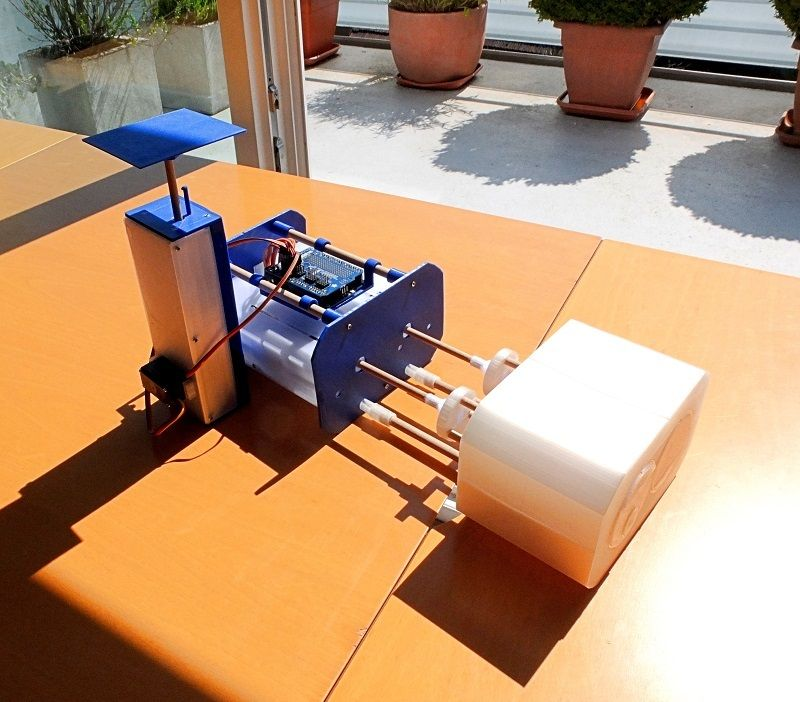
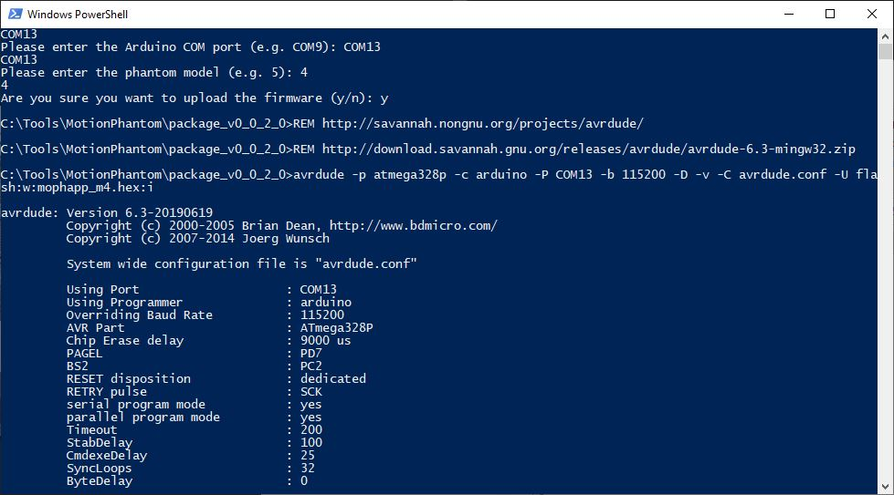

# Liver Deformation X-Ray Imaging Phantom

In the field of medical imaging, so called imaging phantoms are used  to evaluate, analyze, and tune the performance of various imaging  devices (Source: Wikipedia). This specially developed imaging  phantom simulates motion and deformation of a liver based on respiratory motion.

The inspiration for this project was this video on YouTube: ELPHA: Dynamically deforming liver phantom. https://youtu.be/u_GXM9yy9Ok

On an X-Ray image, the material and the density define what is a  bone, a liver or a lung. To simulate the deformation of a liver, an object of a different density than the density of the surrounding structure is needed. Different densities can also be achieved by 3D printed parts with different infill percentages. For this phantom, the printed parts that represent the liver have 60%, the part that represents the gall bladder 90% and the surrounding tissue has a 30% infill percentage.

Whereas the above mentioned ELPHA uses pressure for the deformation, this phantom simulates the  deformation by moving objects relative to each other which together represent a liver. When the left and right cylinder are moved against each other, the liver "shrinks". When the cylinders are moved in opposite direction the liver gets bigger.

This short animation gives you an idea how this phantom would look like on X-Ray images: https://youtu.be/K-1KQQ25YmM

To generate the motion, the phantom uses three [LnR-Actuators](https://www.instructables.com/id/Linear-and-Rotation-Actuator/), an Arduino micro controller and an Adafruit Servo Shield. The micro controller is  required because you cannot be in the room when you acquire X-Ray  images. The phantom can be either be remote controlled from a PC over an USB cable, or you can start one of the pre-programmed motion patterns and use the phantom stand-alone.

This phantom is suitable to evaluate and tune the performance of medical devices. A field of application could be the development of motion tracking and 4D reconstruction algorithms. Some limited imaging dosimetry should also be possible.

The direct material costs are approximately USD 200.

### Supplies:

1 Arduino Uno

1 Adafruit 16-Channel Servo Shield

3 [LnR-Actuator](https://www.instructables.com/id/Linear-and-Rotation-Actuator/)

11 Screw M2 x l10

6 Screw M2 x l20

4 Metal marker d1 x l4 mm, created from paper clip

6 Wooden dowel d6 x l40 mm

3 Wooden dowel d8 x l160 mm

2 Wooden dowel d8 x l110 mm

1 Windows PC with Java 8 runtime and .NET Framework 4.6.2

1 3D Printer

1 Standing drill is of avail

Legend: l:length, d:diameter

## Step 1: 3D Printed Parts

PLA, default 20% infill: LDXIP-Back, LDXIP-CPUPlatform, LDXIP-Flange, LDXIP-FlangeClip, LDXIP-Front, LDXIP-FrontClip, LDXIP-GatingBase, LDXIP-GatingBottom, LDXIP-GatingPlatform, LDXIP-GatingTop

PLA, 30% infill: LDXIP-Body, LDXIP-BodyInsertBack, LDXIP-CylinderLeft, LDXIP-CylinderLeftInsertBack, LDXIP-CylinderRight, LDXIP-CylinderRightCylinderBack,  LDXIP-CylinderRightInsertBack

PLA, 60% infill: LDXIP-BodyInsertCenter, LDXIP-CylinderLeftCylinder, LDXIP-CylinderLeftInsertCenter,  LDXIP-CylinderRightInsertCenter

PLA, 90% infill: LDXIP-CylinderRightCylinderCenter

## Step 2: Assemble the Two Cylinders

To build the left cylinder, insert the four metal markers d1 x l4 mm into the notches of the *LDXIP-CylinderLeftCylinder*. Then insert the *LDXIP-CylinderLeftCylinder* into the *LDXIP-CylinderLeftInsertCenter* and this into the *LDXIP-CylinderLeft*. Add the *LDXIP-CylinderLeftInsertBack* and fixate all the parts with a drop of glue. Insert three wooden  dowels d6 x l40 mm into the holes in the front plane of the cylinder and attach a *LDXIP-Flange*.

To build the right cylinder, insert the *LDXIP-CylinderRightInsertCenter* and add the *LDXIP-CylinderRightInsertBack*. Then insert *LDXIP-CylinderRightCylinderCenter* and *LDXIP-CylinderRightCylinderBack*. Insert three wooden dowels d6 x l40 mm into the holes in the cylinders front and attach a *LDXIP-Flange*.

## Step 3: Assemble the Phantom Body

To build the body, insert the *LDXIP-BodyInsertCenter* and then the *LDXIP-BodyInsertBack* into the *LDXIP-Body*. Insert two wooden dowels d8 x l110 mm into the holes in the phantoms front and attach a *LDXIP-FrontClip.*

## Step 4: Assemble the Actuator Assembly

To build the actuator assembly, fixate three wooden dowels d8 x l160 mm to the *LDXIP-Back* with three screws M2 x l20 mm. Plug-in the two *LnR-Actuators* and add the *LDXIP-Front*. Add a *LDXIP-FlangeClip* to each of the LnR-Actuator shafts but do not fixate it yet.

Plug-in the assembled phantom body into the actuator assembly. Connect the  flange-clip with the flange. Align the cylinders and then fixate the  flange clips with some glue to the actuator shafts.

## Step 5: Add the Gating Platform

To build the Gating assembly, attach the *LDXIP-GatingBottom* to the *LDXIP-GatingBase* with two screws M2 x l10 mm. Plug-in a LnR-Actuator and add the *LDXIP-GatingTop*. Add the *LDXIP-GatingPlatform* and fixate it with a screw M2 x l10 mm. Attach the Gating assembly to the actuator assembly with four screws M2 x l10 mm.

## Step 6:  Add the Micro Controller

Mount the Arduino on the *LDXIP-CPUPlatform* and fixate it with  four screws M2 x l10 mm. Attach the Adafruit Servo Shield. Mount the CPU assembly on the actuator assembly. Connect the servos to the servo  shield in this order: Longitudinal (long cable) Left, Right, Gating.  Rotary (short cable) Left, Right, Gating.

## Step 7: Install the Firmware and Calibrate

Download the package.zip (e.g. package_v0.0.1.1.zip) of the latest release from [github](https://github.com/mrstefangrimm/Phaso/releases/). The download includes the required scripts and the software to control the phantom. Unzip the package into a local folder, e.g. C:\Tools\MotionPhantom. 

Connect the phantom to your PC before the next steps.

In the download is a PowerShell script that uploads the firmware and write the calibration data to the EEPROM. To execute the script, open a PowerShell and change the directory to the target folder. Then type in: .\setup.ps1 and hit <Enter>. 

- The script now lists one or more COM ports. Enter the phantom's port (e.g. COM13).

- For the model, enter: 4

- Confirm the firmware upload with: y

  The script uses avrdude to upload the firmware. After the upload, the firmware is active.

- Confirm the EEPROM update with: y

  The script writes the default calibration to the EEPROM.

- Confirm to run a test with: y

  The test ends with the output: Complete, and resets the firmware.

The phantom is ready for use.

## Step 9: Remote Control It With the Virtual Phantom Application

https://youtu.be/C2IkKYsVn7M

The Virtual Phantom Application is a .NET based application and part of the downloaded package (\Virms.NET\ViphApp.exe). The application simulates X-Ray imaging. And it is possible to connect and control a phantom with the application.

The program always starts with the simulation of the Marker Motion Phantom. Change the phantom on the left control panel to "Liver Phantom".

If the phantom is plugged-in, the port should be listed. Make sure the right phantom is selected before you press "Connect".

On the right control panel, it is possible to either control the motion axes individually or start a program.

If you plan to write your on software: This programming interface is completely documented in this [Wiki](https://github.com/mrstefangrimm/Phaso/wiki).