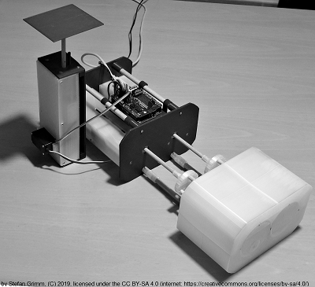

# No2
No2 is a motion phantom with 3 motion axes which are controlled independently for both linear and rotary motion.

## Project History
The project has been launched in 2019.

## File structure
This motion phantom is a electromechanical device which is controlled by an Arduino.
The repository has the sub folders:

- Mechanics
- Software

## Tool Chain and Software libraries

No2 is built with open source tools and open source libraries.

### Mechanics

Tool | Licence
---- | -------
SketchUp | SketchUp Make 2017 User
Ultimaker Cura | GPL

Device | Licence
---- | -------
LnR-Actuator | CC BY-SA

### Software

Application | Licence
----------- | -------
mophapp | GPL
SoftDKb2 | LGPL
VirtualNo2  | LGPL

Tool | Licence
---- | -------
Arduino IDE | GPL
avrdude | GPL
Processing | GPL
gcc | GPL
VS2017 community | MS license

Libraries

Library | Licence
------- | -------
prfServo | LGPL
mophlib | LGPL, BSD
Processing Core | LPGL
.NET 4.6.2 | MS license
Helix toolkit | MIT

## License
This work is licensed under the Creative Commons Attribution-ShareAlike 4.0 International License. To view a copy of this license, visit http://creativecommons.org/licenses/by-sa/4.0/ or send a letter to Creative Commons, PO Box 1866, Mountain View, CA 94042, USA.
